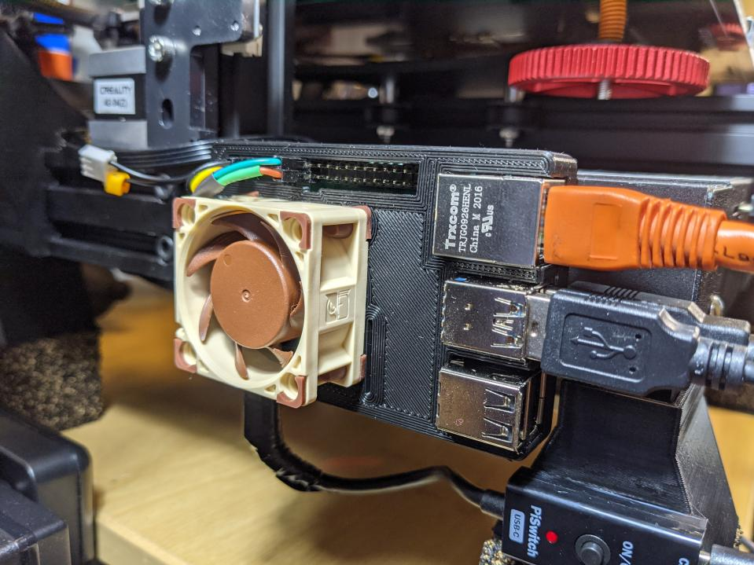

# PWM Raspberry Pi Fan



Why?

Because I accidentally ordered Noctua PWM fans instead of FLX ones and all other Raspberry Pi PWM solutions I found were unacceptable with 20%+ idle CPU usage, out-of-date dependencies, etc. I wanted something light-weight that I can fully trust as a core system utility in `/usr/sbin`.

### Wiring:

**This configuration is for a 5V PWM fan!**

Pin numbers are basic Raspberry Pi "pin 1 starts at J8" numbers (not GPIO/etc. numbers).

* **PWM +5V** - Pin 4
* **PWM Ground** - Pin 6
* **PWM Signal +5V** - Pin 12
* **PWM Speed Signal** - Pin 18; bridged to pin 17 (3.3V) with a 1k Ohm resistor

For a better visual follow wiring diagram listed here: https://blog.driftking.tw/en/2019/11/Using-Raspberry-Pi-to-Control-a-PWM-Fan-and-Monitor-its-Speed/#Wiring

### Building/Installing:

**Requirements:**
* `wiringPi.h` via obtainable with `sudo apt install wiringpi`

```bash
# Compile
make compile

# Compile with debugging enabled
make compile-debug

# Running (requires sudo to control GPIO)
sudo ./pwm_fan_control

# Installing (will make persistent service that starts at boot)
sudo make install
sudo make uninstall
```

### Notes:

* Only tested with a Raspberry Pi 4 but should work fine with other models that have PWM capability

### Helpful Resources:

* https://www.electronicwings.com/raspberry-pi/raspberry-pi-pwm-generation-using-python-and-c
* https://blog.driftking.tw/en/2019/11/Using-Raspberry-Pi-to-Control-a-PWM-Fan-and-Monitor-its-Speed/#Wiring
* https://www.raspberrypi.org/forums/viewtopic.php?f=32&t=133251&sid=519dae0c236d41f941c140190fe2bec7
* https://raspberrypi.stackexchange.com/a/6979
* http://wiringpi.com/
